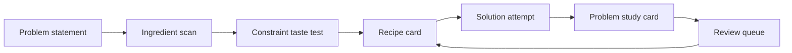

# 🍳 LeetCode Cookbook

> **Ingredients reveal the recipe.**

A pattern-recognition kitchen for LeetCode, built as an [Obsidian](https://obsidian.md) vault. Instead of asking *"have I seen this exact problem?"*, you learn to ask *"what ingredients are on the counter, and which recipe do they reveal?"* — and you drill that recognition until it is automatic.

This repo is a **template**: clone it, open it in Obsidian, and make it your own study vault. It also ships a `/cook` skill for [Claude Code](https://claude.com/claude-code) that coaches you through pattern recognition the right way.

## What it is

The vault is organized like a kitchen. Each area maps to one stage of turning a problem into durable recognition:

| Kitchen area | Folder | Purpose |
|---|---|---|
| Pantry | `01 - Pantry - Ingredients` | Signals, constraints, keywords, and prompt clues. |
| Recipe cards | `02 - Recipe Cards - Patterns` | One note per algorithmic pattern: template, invariant, variations, mistakes. |
| Dishes | `03 - Dishes - Problems` | One study card per solved problem. |
| Meal plans | `04 - Meal Plans - Practice` | Daily and weekly practice loops. |
| Tasting room | `05 - Tasting Room - Review` | Reviews, mistakes, invariants, spaced repetition. |
| Templates | `06 - Templates` | Note templates for problems, recipes, and reviews. |
| Dashboards | `07 - Dashboards` | Dataview-ready tables and manual indexes. |
| Source | `99 - Source` | The food-native pattern guide the vault is built around. |

The core idea: **the goal is recognition, not trophy collection.** Every problem card starts with one sentence — *"This looks like \_\_\_ because \_\_\_"* — written **before** any code.

## The recognition loop



## The `/cook` skill (Claude Code)

The vault ships a custom [Claude Code](https://claude.com/claude-code) skill at `.claude/skills/cook/`. Run `/cook` and paste a LeetCode problem, and it acts as a **Socratic recognition coach**:

- It makes you **commit** to an ingredient scan, a complexity budget, and a pattern guess *before* it reveals anything — no spoilers, and it never does the thinking for you.
- It hides the official difficulty and topic tags until after you have committed to a guess.
- When you are done, it files a complete dish card as the byproduct.

The skill is optional — the vault works entirely as plain Markdown without it — but it is the fastest way to build the recognition habit the vault is designed around.

## Quick start

1. **Clone** this repo:
   ```sh
   git clone https://github.com/sha-ir/leet_kitchen.git
   ```
2. **Open** the folder as a vault in [Obsidian](https://obsidian.md) (*Open folder as vault*).
3. Read `START HERE.md`, then `00 - Kitchen Home/Cookbook Home.md`.
4. *(Optional)* For live dashboards, install the **Dataview** community plugin (*Settings → Community plugins → Browse → Dataview*). Without it, the dashboard notes still render as plain Markdown.
5. *(Optional)* For the `/cook` coach, open this folder as a [Claude Code](https://claude.com/claude-code) workspace and run `/cook`.

## Make it your own

The vault ships with four `Example -` dish cards so you can see the format. When you are ready to start your own collection, clear them:

```sh
sh scripts/reset-vault.sh
```

That removes the four example dishes and de-lists them from the Problem Cards Index. It leaves everything else — recipe cards, the pantry, templates, dashboards, the review methodology, and the Mistake Pantry study library — untouched.

Prefer to do it by hand? Delete the four `03 - Dishes - Problems/Example - *.md` files and remove their links from the "Seed examples" section of `03 - Dishes - Problems/Problem Cards Index.md`.

## License

[MIT](LICENSE) © 2026 sha-ir.

The food-native pattern guide in `99 - Source` and the rest of the vault content are the author's original work.
