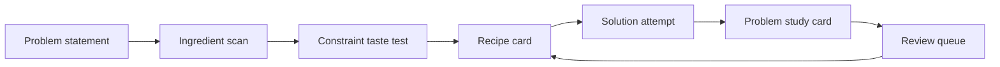

# LeetCode Cookbook Vault

> **Ingredients reveal the recipe.**

This vault is a pattern-recognition kitchen for LeetCode. Do not start by asking, “Have I seen this exact problem?” Start by asking, “What ingredients are on the counter, and which recipe do they reveal?”

## Open these first

1. [[Cookbook Home]] — the main map.
2. [[Problem-Solving Flow]] — the checklist to run before coding.
3. [[Master Recipe Table]] — match ingredients to recipe cards.
4. [[Recipe Index]] — all food-native pattern cards.
5. [[Daily Consumption Plan]] — the 3-problem-per-pattern study loop.

## The vault loop

## Today’s tiny ritual

- Pick one recipe from [[Pattern Rotation Menu]].
- Solve one problem using [[Template - Problem Study Card]].
- Add one mistake or invariant to [[Mistake Pantry]] or [[Invariant Library]].
- End by saying: **“I can recognize this dish again because ___.”**

## Optional power tools

The vault works as plain Markdown. If you use Dataview, the notes in [[Pattern Dashboard]], [[Problem Dashboard]], [[Review Dashboard]], and [[Mistake Dashboard]] become live tables.
